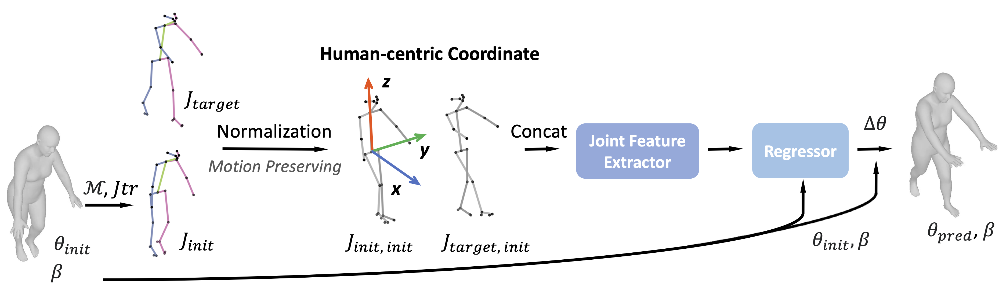

# Learnable SMPLify: A Neural Solution for Optimization-Free Human Pose Inverse Kinematics

#### <p align="center">[arXiv Paper](https://arxiv.org/abs/TBD)</p>




``TL;DR``: Given X_{t-s} and X_{t} 3D keypoints, 
calculate residual SMPL parameters from t-s to t.


## TODO
update arxiv link, add citation

## Preparation
Refer to [PREPARATION.md](doc/PREPARATION.md) for installation and data preparation details.

## Checkpoints
The pretrained model checkpoint is available at [Google Drive](https://drive.google.com/drive/folders/1oyG2gbB3EMcc6NgTIT1p1uJ_Em0dJwXz?usp=sharing).

## Usage
### Training
cd to `src` folder and run the following command.

```
torchrun --nproc-per-node <NUM_GPUS> main.py --config configs/net.yaml (--extra_tag <EXTRA_TAG> --batch_size <BATCH_SIZE> --epochs <EPOCHS>)
```

You can get logs, tensorboard and checkpoints in the corresponding `logs/<MODEL_NAME>_net_<EXTRA_TAG>` folder.

### Evaluation
To evaluate the model, run the following command:

```
torchrun --nproc-per-node <NUM_GPUS> main.py --config configs/net_<DATASET>.yaml --eval --checkpoint <PATH_TO_CHECKPOINT>
```

## Citation
If you find this work useful in your research, please consider citing:

```
```

## Acknowledgement
We thank the authors of [ST-GCN](https://github.com/open-mmlab/mmskeleton), [ReFit](https://github.com/yufu-wang/ReFit), [OSX](https://github.com/IDEA-Research/OSX/tree/main) for their great works. We partially refer to their codebases for this project.